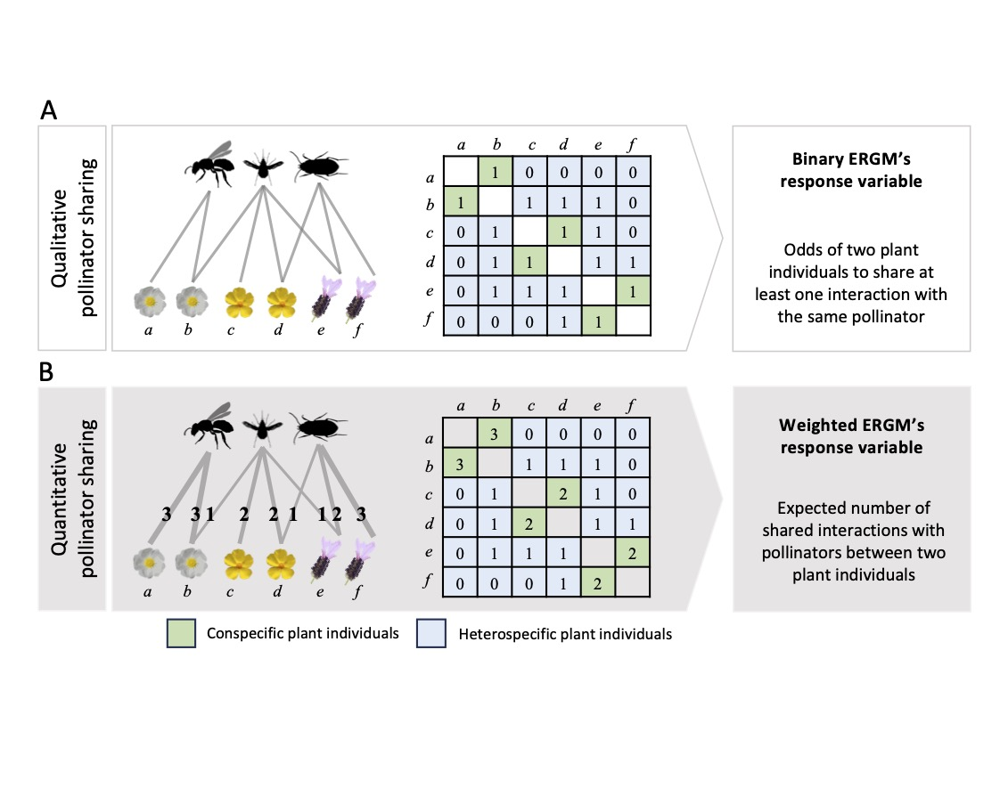

# Flowering synchrony modulates pollinator sharing and places plant individuals along a competition–facilitation continuum

Indirect interactions among species within ecological communities govern ecological and evolutionary processes as much as, or even more, than direct effects. In insect-pollinated plant communities, indirect interactions between plants can be mediated by shared pollinators, and may influence plant fitness, population growth and community structure. As individuals are the entities actually interacting in nature, rather than species, downscaling a hierarchical level (i.e., from species to individuals) is essential to understand the underlying processes promoting these indirect interactions. We combined empirical data on plant–pollinator interactions collected in Mediterranean shrublands with a novel modelling framework to assess how the patterns of heterospecific and conspecific pollinator sharing between plant individuals are generated and their fitness implications. We found that the effects of flowering synchrony on pollinator sharing among conspecific and heterospecific plant individuals outperformed those of spatial distance. Our results revealed that plant individuals that shared more pollinators with conspecifics were also involved in a higher pollinator sharing with heterospecifics. For most plant species, the sharing of pollinator species between heterospecific plant individuals produced positive mean fitness outcomes, as long as plants did not share many pollinator interactions, which had negative effects on their fitness. At the level of plant individuals, we found that specific combinations of conspecific and heterospecific pollinator sharing lead to distinct reproductive outcomes that placed each individual along a competition–facilitation continuum. Interestingly, most plant species included a higher proportion of individuals likely experiencing competition compared to those potentially involved in facilitation processes. Our contribution provides novel insights into the factors responsible for local-scale indirect interactions within communities and their individual-level functional consequences. Such intricate patterns of indirect interactions have far-reaching implications, as the transitions of plant individuals along competitive or facilitative processes mediated by shared mutualists may contribute significantly to the functioning and coexistence of ecological communities.

